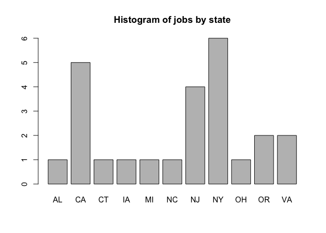

# HW 12 - Data scraping
Michelle Lee  
December 8, 2014  

After exploring all the different packages available for data scraping, I decided I wanted to learn how to start from scratch. I picked a simple website, [CareerBuilder](http://www.careerbuilder.com/?sc_cmp2=js_home_cblogo) with a query. For this example, the [query was "data r" jobs](http://www.careerbuilder.com/jobseeker/jobs/jobresults.aspx?qb=1&SB%3Asbkw=r+data&SB%3As_freeloc=&SB%3Asbfr=30&sbsbmt=Find+Jobs&IPath=ILKV&excrit=st%3DA%3Buse%3DALL%3BrawWords%3Dr%3BCID%3DUS%3BSID%3D%3F%3BTID%3D0%3BLOCCID%3DUS%3BENR%3DNO%3BDTP%3DDRNS%3BYDI%3DYES%3BIND%3DALL%3BPDQ%3DAll%3BPDQ%3DAll%3BPAYL%3D0%3BPAYH%3DGT120%3BPOY%3DNO%3BETD%3DALL%3BRE%3DALL%3BMGT%3DDC%3BSUP%3DDC%3BFRE%3D30%3BCHL%3DAL%3BQS%3DSID_UNKNOWN%3BSS%3DNO%3BTITL%3D0%3BOB%3D-relv%3BVT%3DTITLE%3BJQT%3DRAD%3BJDV%3DFalse%3BSITEENT%3DUSJOB%3BMaxLowExp%3D-1%3BRecsPerPage%3D25&cid=US&findjob=sb).

If you want to try it yourself, please click on "Job Titles Only" - I haven't yet figured out how to manage the rest. 

I first loaded the libraries:


```r
library(rvest)
```

```
## Warning: package 'rvest' was built under R version 3.1.2
```

```r
library(httr)
```

I obtained the url (remember to click the "Title only" option!), using `httr` and `rvest`:


```r
html <- html("http://www.careerbuilder.com/jobseeker/jobs/jobresults.aspx?qb=1&SB%3Asbkw=r+data&SB%3As_freeloc=&SB%3Asbfr=30&sbsbmt=Find+Jobs&IPath=ILKV&excrit=st%3DA%3Buse%3DALL%3BrawWords%3Dr%3BCID%3DUS%3BSID%3D%3F%3BTID%3D0%3BLOCCID%3DUS%3BENR%3DNO%3BDTP%3DDRNS%3BYDI%3DYES%3BIND%3DALL%3BPDQ%3DAll%3BPDQ%3DAll%3BPAYL%3D0%3BPAYH%3DGT120%3BPOY%3DNO%3BETD%3DALL%3BRE%3DALL%3BMGT%3DDC%3BSUP%3DDC%3BFRE%3D30%3BCHL%3DAL%3BQS%3DSID_UNKNOWN%3BSS%3DNO%3BTITL%3D0%3BOB%3D-relv%3BVT%3DTITLE%3BJQT%3DRAD%3BJDV%3DFalse%3BSITEENT%3DUSJOB%3BMaxLowExp%3D-1%3BRecsPerPage%3D25&cid=US&findjob=sb")
```

... and then made a function to organize the data:


```r
getJobs <- function(url) {
	
	# Clean the title column of job titles
	cleanTitle <- function(html, node) {
		# scrape the data
		text <- html_nodes(html, node)
		
		# clean the data using regex
		text <- gsub("\\n|\\r|\\t|View similar jobs|  | - |", "", html_text(text))
		
		# organize the data into a matrix
		matrix(unlist(strsplit(as.character(text), "    ")))[-1,1]
		}
	title<- cleanTitle(html, ".jl_col2")
	
	# Clean the company column of company names
	cleanComp <- function(html, node) {
		# scrape the data
		text <- html_nodes(html, node)
		
		# clean the data using regex
		text <- gsub("\\n|\\r|\\t|  |", "", html_text(text))
		
		# organize the data into a matrix
		matrix(unlist(strsplit(as.character(text), "$$$")))[-1,1]
		}
	company <- cleanComp(html, ".jl_col3")
	
	# Clean the location column of company names
	cleanLoc <- function(html, node) {
		# scrape the data
		text <- html_nodes(html, node)
		
		# clean the data using regex
		text <- gsub("\\n|\\r|\\t|  |+1 more|Relocate to |+|,", "", html_text(text))
		
		# organize the data into a matrix
		text <- matrix(unlist(strsplit(as.character(text), "$$$")))[-1,1]
		
		# split the column into two: state and city
		text<- as.data.frame(matrix(unlist(strsplit(as.character(text), " - ")), ncol=2, byrow=T))
		}
	loc <- cleanLoc(html, ".jl_col4");loc
	
	# Add "NA" if there is an empty space instead
	cbind.fill <- function(...){
		nm <- list(...) 
		nm <- lapply(nm, as.matrix)
		n <- max(sapply(nm, nrow)) 
		do.call(cbind, lapply(nm, function (x) 
			rbind(x, matrix(, n-nrow(x), ncol(x))))) 
		}
	
	# return the dataset
	data <- as.data.frame(cbind.fill(title, company, loc))
	colnames(data) <- c("title", "company", "state", "city")
	return(data)
	}
```

To try it out:


```r
knitr::kable(getJobs(url), format="markdown")
```


|title                                                           |company                    |state |city                |
|:---------------------------------------------------------------|:--------------------------|:-----|:-------------------|
|Data Analyst / R Programmer/ R Analytics                        |APN Software Solutions     |NY    |New York NY         |
|Data Scientist                                                  |Collabera Inc.             |CA    |San Jose CA+        |
|Data Evangelist-- Hadoop/R                                      |Kforce Technology          |NJ    |Princeton           |
|Data Scientist / Modeller (R / SAS, Python)                     |Collabera Inc.             |NY    |New York            |
|Market Researcher/Data ScientistNYC                             |Analytic Recruiting        |NY    |New York            |
|A/P A/R Specialist                                              |CRG Workforce              |NC    |Charlotte           |
|R&D Market Data Feeds Analysts                                  |Genesis10                  |NY    |New York            |
|R / SAS Programmer                                              |Collabera Inc.             |NY    |New York            |
|Data Analyst/Data Science – R, Python, Hadoop                   |Progressive Insurance      |OH    |Mayfield Heights    |
|Data Scientist                                                  |Ashley Ellis               |CA    |Norwalk             |
|Jr. Oracle Federal Financials R12 Developer                     |I360 Technologies          |VA    |Falls Church        |
|R programmer developer                                          |Collabera Inc.             |CA    |Irvine              |
|Data/Pricing Analyst                                            |Johnstone Supply           |OR    |Portland OR         |
|File/Data Entry Clerk                                           |D.R. Horton                |AL    |Daphne              |
|Drug Safety Data Management Specialist                          |Pioneer Data Systems Inc   |NJ    |Peapack             |
|Data Scientist                                                  |Townsend & Associates      |NJ    |Florham Park        |
|Data Modeler                                                    |The Computer Merchant, Ltd |NJ    |Mount Laurel        |
|Engineer / PE / Pharmaceutical / Biotechnology / Architect / RA |Rice Consultants LLC       |MI    |Detroit             |
|R Programmer                                                    |Smiths Medical             |CA    |San Carlos          |
|Sr. Validation Specialist (R&D Engineer)                        |Analytic Recruiting        |CT    |Southington         |
|Seeking Data Analytics ProfessionalsOpen                        |Diamond Foods, Inc.        |NY    |Metro area          |
|Food Scientist � R&D                                            |Noel-Levitz                |OR    |Salem               |
|Data Integrity Analyst                                          |WellZone                   |IA    |Iowa City IA        |
|Biostatistics Manager DirectorClinical Data                     |NA                         |CA    |South San Francisco |
|Data Scientist                                                  |NA                         |VA    |McLean              |

To explore the data a bit:


```r
x<- getJobs(url)
plot(sort(x$state), main="Histogram of jobs by state")
```

 


## Reflections

* This assignment took me a very long time, for such little material produced :( I experimented with `httr` and `rvest` a lot, which took a lot of time.

* I had a *lot* of issues when trying to make this, especially on regex, and it's nowhere perfect. One thing that I am still trying to figure out: regex to get rid of the plus sign, '+'. `gsub("\+", "", text)` didn't work, and I tried a number of variations on it, e.g. `\\+`, `\\b[+]`, and so on... 

* The libraries like `rplos` are very convenient in extracting data, and when I have some time, I will be looking at the functions to see how they managed to extract the data so neatly. 

Thanks for reading/marking my assignment! Hope you have a merry Christmas (in 3 weeks)!

