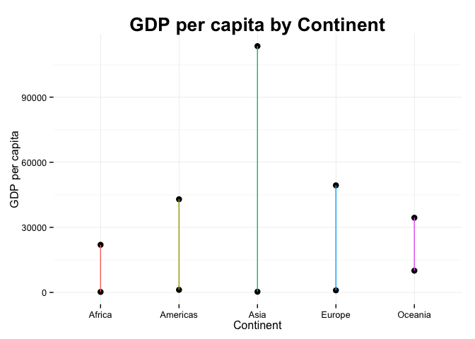
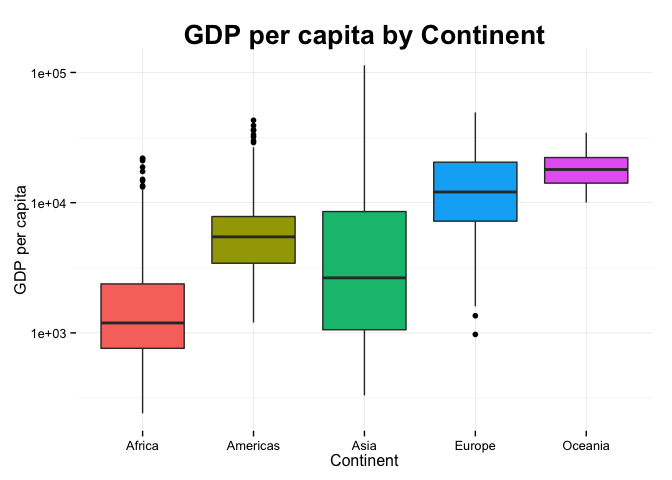
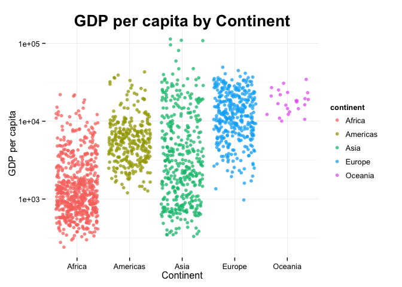
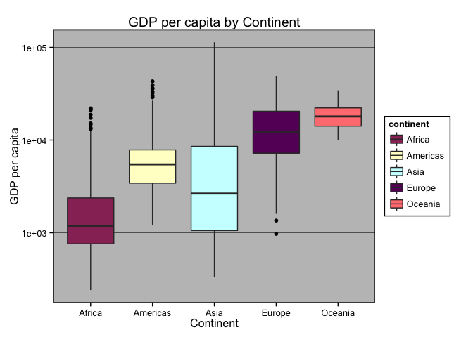
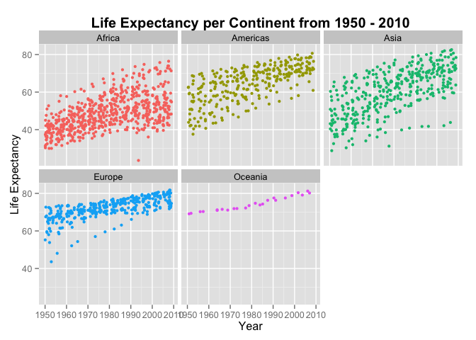
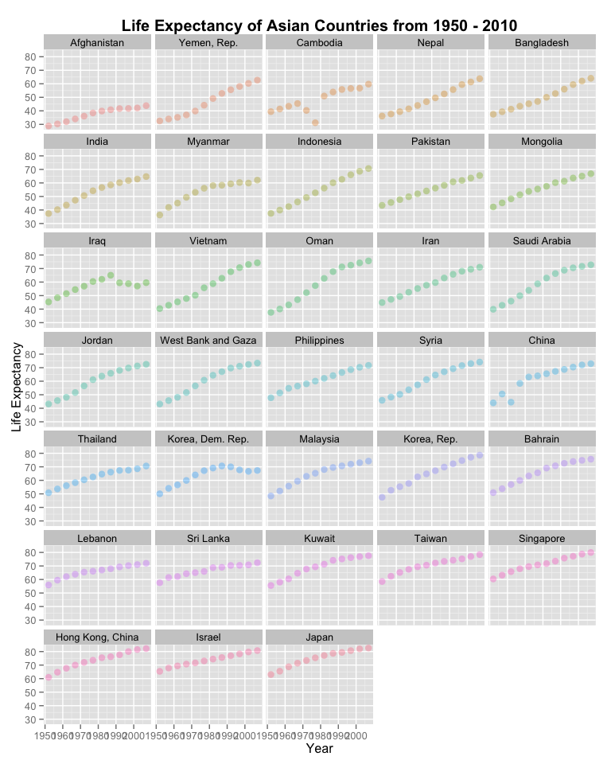
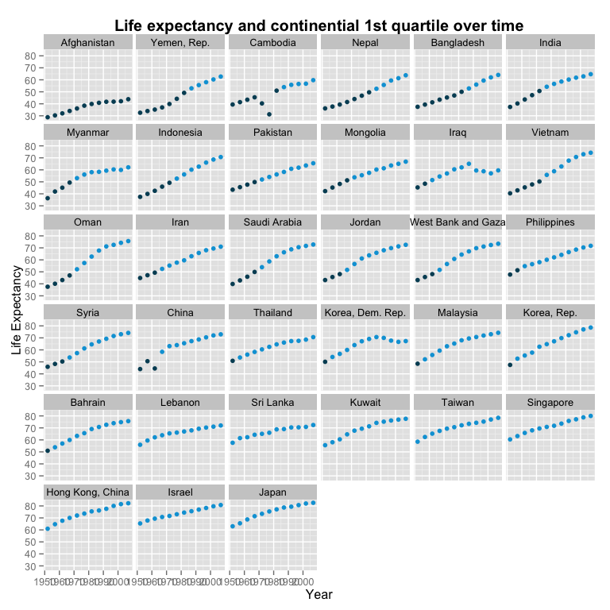

# HW 3: dplyr and data exploration
Michelle Lee  
September 29, 2014  

## Prior Tasks

I loaded the libraries first, and then converted to a data frame table. 

```r
library(ggplot2)
library(ggthemes)
library(knitr)
library(reshape2)
suppressPackageStartupMessages(library(dplyr))
gDat <- read.delim("gapminderDataFiveYear.txt")
gtbl <- tbl_df(gDat)
```


## Task 1: Get the maximum and minimum of GDP per capita for all continents.

With `dplyr`, this task is straightforward. I used `knitr::kable` to automatically format the table. 

```r
gdp.tbl=gtbl %>%
  group_by(continent) %>%
  summarise_each(funs(min, max), gdpPercap)
knitr::kable(gdp.tbl) # use knitr:kable to automatically format the table 
```

```
## 
## 
## |continent |     min|    max|
## |:---------|-------:|------:|
## |Africa    |   241.2|  21951|
## |Americas  |  1201.6|  42952|
## |Asia      |   331.0| 113523|
## |Europe    |   973.5|  49357|
## |Oceania   | 10039.6|  34435|
```

To show clearly the minimum and maximum, I used `reshape2` to melt the table.

```r
min.max= gdp.tbl %>%
  melt # combine the max and min values, organized by continent
```

```
## Using continent as id variables
```

The plot of minimum and maximum GDP is below.


```r
ggplot(min.max, aes(x = continent, y = value, fill = continent)) + geom_point(lwd=3) +  # just the min and max vals
  guides(fill = F) + theme_minimal() + ggtitle("GDP per capita by Continent") + geom_line(aes(colour=continent)) + 
  theme(plot.title = element_text(lineheight=.8, face="bold", size = 20)) + xlab("Continent") + ylab("GDP per capita") + theme(legend.position="none")
```

 

[Andrew Macdonald was right](https://twitter.com/polesasunder/status/464132152347475968) - people only read graphs instead of charts, myself included. You can see right away the huge variation in GDP per capita within Africa and Asia. 

I made this plot as simple as possible because the task was to find the minimum and maximum. I originally plotted a boxplot, but a boxplot has plenty of information that this task doesn't need. 


## Task 2: Look at the spread of GDP per capita within the continents.

We can use `summarise_each` to calculate GDP per capita in different ways. 


```r
gdp.var <- gtbl %>%
  group_by(continent) %>%
  summarise_each(funs(mean, median, sd), gdpPercap)
knitr::kable(gdp.var)
```

```
## 
## 
## |continent |  mean| median|    sd|
## |:---------|-----:|------:|-----:|
## |Africa    |  2194|   1192|  2828|
## |Americas  |  7136|   5466|  6397|
## |Asia      |  7902|   2647| 14045|
## |Europe    | 14469|  12082|  9355|
## |Oceania   | 18622|  17983|  6359|
```

A typical boxplot that makes it immediately clear the spread of GDP within continents.


```r
ggplot(gtbl, aes(x = continent, y = gdpPercap, fill = continent)) + geom_boxplot() +  guides(fill = F) + 
  theme_minimal()+ scale_colour_brewer() + scale_y_log10() + ggtitle("GDP per capita by Continent") + 
  theme(plot.title = element_text(lineheight=.8, face="bold", size = 20)) + xlab("Continent") + ylab("GDP per capita")
```

 

From the boxplot, we can see the means, medians, ranges, quartiles, etc. all at once - definitely faster than looking at the table!

A dot plot, while not as obvious, shows where the data points are clumped. `jitter` makes it easier to see these dots. 


```r
ggplot(gtbl, aes(x = continent, y = gdpPercap, fill = continent)) + 
  geom_point(alpha=3/4, aes(colour=continent), position="jitter") + # jitter spreads out the points 
  guides(fill = F) + theme_minimal() + scale_y_log10()+ ggtitle("GDP per capita by Continent") + 
  theme(plot.title = element_text(lineheight=.8, face="bold", size = 20)) + xlab("Continent") + ylab("GDP per capita")
```

 

I'm fairly new to ggplot2, and still can't stop admiring how beautiful these graphs are with such minimal effort. In case you've forgotten, here's the same boxplot in Excel 2003 (note: this theme must be used for ironic purposes only)


```r
ggplot(gtbl, aes(x = continent, y = gdpPercap, fill = continent)) + geom_boxplot() + 
  theme_excel()+ scale_colour_excel() + scale_fill_excel() + scale_y_log10() + 
  ggtitle("GDP per capita by Continent") + xlab("Continent") + ylab("GDP per capita")
```

 

Never again.


## Task 3: How is life expectancy changing over time on different continents?

My original data frame was in long format, which is good for analyzing data but not so much for readability. I used `dcast` to change the data from long to wide.

```r
life.time <- gtbl %>%
  group_by(year, continent) %>%
  summarize("mean.le" = mean(lifeExp))
life.time.long <- dcast(life.time, year~continent, value.var="mean.le") # change from long to wide
knitr::kable(life.time.long)
```

```
## 
## 
## | year| Africa| Americas|  Asia| Europe| Oceania|
## |----:|------:|--------:|-----:|------:|-------:|
## | 1952|  39.14|    53.28| 46.31|  64.41|   69.25|
## | 1957|  41.27|    55.96| 49.32|  66.70|   70.30|
## | 1962|  43.32|    58.40| 51.56|  68.54|   71.08|
## | 1967|  45.33|    60.41| 54.66|  69.74|   71.31|
## | 1972|  47.45|    62.39| 57.32|  70.78|   71.91|
## | 1977|  49.58|    64.39| 59.61|  71.94|   72.86|
## | 1982|  51.59|    66.23| 62.62|  72.81|   74.29|
## | 1987|  53.34|    68.09| 64.85|  73.64|   75.32|
## | 1992|  53.63|    69.57| 66.54|  74.44|   76.94|
## | 1997|  53.60|    71.15| 68.02|  75.51|   78.19|
## | 2002|  53.33|    72.42| 69.23|  76.70|   79.74|
## | 2007|  54.81|    73.61| 70.73|  77.65|   80.72|
```

A comparison of life expectancy trends, by continent, again using `jitter` for the points to be more easily visible. 

```r
ggplot(gtbl, aes(x = year, y = lifeExp, color = continent)) + geom_jitter(size = 1.5) + 
  facet_wrap(~ continent) +  ggtitle("Life Expectancy per Continent from 1950 - 2010") + 
  theme(legend.position="none", plot.title = element_text(size = 15, face="bold")) + # No legend 
  scale_color_discrete() + xlab("Year") + ylab("Life Expectancy")
```

 

Not only can we tell the rate of change in life expectancy, we can also see the variation within continents. 

## Task 7 (Make your own!), though related to Task 3: How is life expectancy changing over time in Asia? 

I strugged with this in HW2 on how to reorder factors. Thanks to Jenny's tutorial, I finally got it this time. The command had to be separated from the first `asia.le` data frame for the reordering of factors to work. 


```r
asia.le <- gtbl %>%
  filter(continent=="Asia") %>%
  select(country, year, lifeExp)
asia.le <- within(asia.le, country <- reorder(country, lifeExp)) # need to separate this command for re-ordering of factors
```

Why the re-ordering of factors? I reordered it so the plots were organized, in ascending order, the life expectancy in 1950.

```r
ggplot(asia.le, aes(y = lifeExp, x = year)) + geom_point(alpha = (1/3), size = 3, aes(color=country)) + 
  facet_wrap(~ country, ncol=5, nrow=8) + ggtitle("Life Expectancy of Asian Countries from 1950 - 2010") + 
  theme(legend.position="none", plot.title = element_text(size = 15, face="bold")) + 
  xlab("Year") + ylab("Life Expectancy")
```

 

ggplot automatically organizes the graphs according to alphabetical order, which doesn't make sense if you want to compare country trends. I chose life expectancy in ascending order so that the rate of change was more obvious.


## Task 5: Report the absolute and/or relative abundance of countries with low life expectancy over time.

I will look at the relative abundance of low life expectancies within Asia: which countries' life expectancies are below the continential bottom quartile, and how many times over the years they were below. 


```r
asia.1q <- quantile(asia.le$lifeExp, 0.25)
```


```r
asia.relative.le <- asia.le %>%
  filter(lifeExp < asia.1q) %>%
  group_by(country) %>%
  tally %>% 
  arrange(desc(n))
knitr::kable(asia.relative.le)
```

```
## 
## 
## |country            |  n|
## |:------------------|--:|
## |Afghanistan        | 12|
## |Yemen, Rep.        |  7|
## |Cambodia           |  7|
## |Nepal              |  7|
## |Bangladesh         |  7|
## |India              |  5|
## |Indonesia          |  5|
## |Vietnam            |  5|
## |Myanmar            |  4|
## |Pakistan           |  4|
## |Mongolia           |  4|
## |Oman               |  4|
## |Saudi Arabia       |  4|
## |Iran               |  3|
## |Jordan             |  3|
## |West Bank and Gaza |  3|
## |Syria              |  3|
## |China              |  3|
## |Iraq               |  2|
## |Philippines        |  2|
## |Thailand           |  1|
## |Korea, Dem. Rep.   |  1|
## |Malaysia           |  1|
## |Korea, Rep.        |  1|
## |Bahrain            |  1|
```

Now, we can try plotting this. The discrete colour scale makes it easy to see exactly when countries escaped the bottom quartile. (Although it somewhat resembles Snake)


```r
ggplot(asia.le, aes(x = year, y = lifeExp, colour = lifeExp < asia.1q)) + geom_point(aes(group=year)) + 
  facet_wrap(~ country) + ggtitle("Life expectancy and continential 1st quartile over time") + 
  theme(legend.position="none", plot.title = element_text(size = 15, face="bold")) + xlab("Year") + 
  ylab("Life Expectancy") + scale_color_economist()
```

 


## Report your process. 

* The shortcut for `%>%` is Shift-Alt-> for Macs! Don't make the same mistake I did (using Command + option + m) which will minimize RStudio.
* Jenny wasn't kidding when she said `magrittr` and `dplyr` would change our lives. Complicated problems became trivial once I got the hang of using `tbl_df` and ` %>%`. 
* I had too much fun playing with Jeffrey Arnold's `ggthemes`. Documentation is [here.](https://github.com/jrnold/ggthemes)
* ggplot2 is amazing. I'm still amazed by how quickly these graphs can be created, with intuitive colour scales and themes. The only issue I see with it is that there are quite a bit of small details that need tweaking, that are very difficult to fix in R itself. [Nathan Yau's](flowingdata.com) process is to make all graphics in R first and Illustrator after, and I think I will be following that procedure from now on. 
