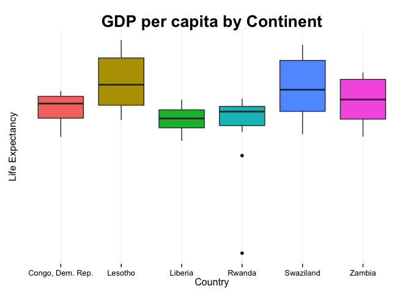
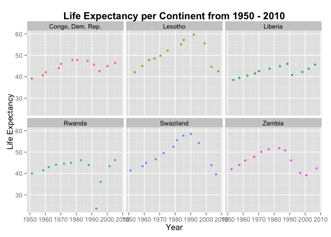
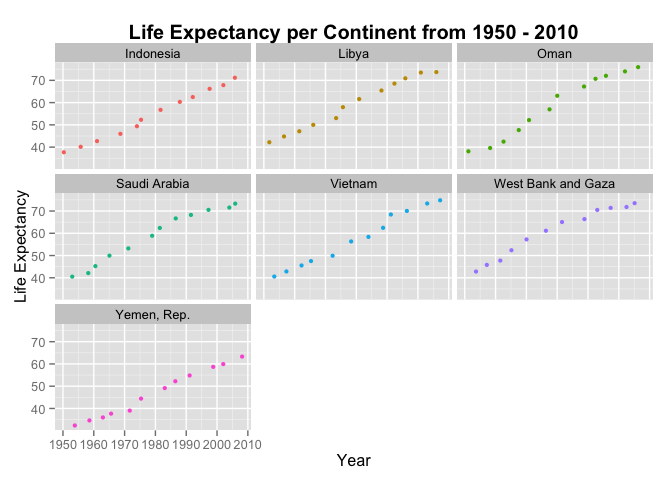
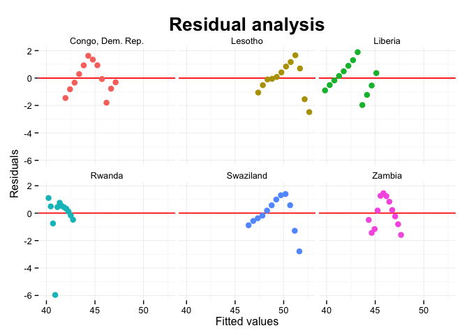
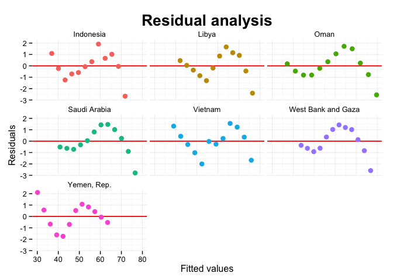

# HW 4 Part 2: Using plyr to apply functions
Michelle Lee  
October 8, 2014  


### Setup

We first load the libraries and data.


Now I will import all the functions that I wrote in Part 1. The first is the linear model on life expectancy and year.


```r
le.lm.fcn<- function(x, offset=1952){
  
  # checking
  assert_that(is.data.frame(x)) # test that it is a data frame
  assert_that(is.numeric(offset)) # test that it is a number
  
  # obtain data
  est.coefs <- coef(lm(lifeExp~I(year - offset),data=x))
  est.coefs <- as.data.frame(t(est.coefs))
  colnames(est.coefs) <- c("intercept","slope")
  return(est.coefs)
}
```

The second function produces residuals, effects, and fitted values. 


```r
# types of residuals: standardized; studentized; and raw. 
res.fcn <- function(x, offset=1952, type = c("student", "standard", "raw")) {
  
  # check if everything works
    assert_that(is.data.frame(x))
    assert_that(is.string(type))
    assert_that(is.numeric(offset))
    
    # initial model results
    model <- lm(lifeExp~I(year - offset),data=x)
    effects <- model$effects
    fitted.vals <- model$fitted.values
    
    # what kind of residual
    if (type=="student") {
      res <- rstudent(model)
    } else if (type=="standard") {
      res <- rstandard(model)
    } else if (type=="raw") {
      res <- model$residuals
    } else 
      return("Sorry, this is not a proper residual type. Please pick one of the three: 'student', 'standard', or 'raw'.")
    
    # get final results
    results <- cbind(x$year, res, effects, fitted.vals)
    colnames(results) <- c("year", "residuals", "effects", "fitted_values")
    return(results)
}
```


### Part 2: Using the functions!

We can see which countries have the largest and smallest slope in life expectancy over time, with the function we created earlier. 

Some questions we can ask:
* Which countries have the lowest intercept and smallest slope, i.e. very little improvement in life expectancy?


```r
life.exp <- tbl_df(ddply(gDat, ~ continent + country, le.lm.fcn))
low.le<- life.exp %>%
  filter(slope < 0.1, intercept < 50) %>%
  arrange(intercept)
knitr::kable(low.le)
```


|continent |country          | intercept|   slope|
|:---------|:----------------|---------:|-------:|
|Africa    |Liberia          |     39.84|  0.0960|
|Africa    |Congo, Dem. Rep. |     41.96|  0.0939|
|Africa    |Rwanda           |     42.74| -0.0458|
|Africa    |Swaziland        |     46.39|  0.0951|
|Africa    |Lesotho          |     47.38|  0.0956|
|Africa    |Zambia           |     47.66| -0.0604|

These 6 countries have had the lowest life expectancies since 1952 and very little improvement over time. We can also plot this as boxplots below:


```r
low.le.countries <- gDat %>%
  filter(country %in% c("Liberia", "Congo, Dem. Rep.", "Rwanda", "Swaziland", "Lesotho", "Zambia"))

ggplot(low.le.countries, aes(x = country, y = lifeExp, fill=country)) + 
  geom_boxplot() +  guides(fill = F) + theme_minimal()+ scale_colour_brewer() + 
  scale_y_log10() + ggtitle("GDP per capita by Continent") + 
  theme(plot.title = element_text(lineheight=.8, face="bold", size = 20)) + 
  xlab("Country") + ylab("Life Expectancy")
```

 

It is easy to see the spread is much greater in Lesotho and Swaziland (and two major outliers in Rwanda), but the boxplot is somewhat uninformative. A plot over time, however, can be more interesting:


```r
ggplot(low.le.countries, aes(x = year, y = lifeExp, color = country)) + geom_jitter(size = 1.5) + 
  facet_wrap(~ country) +  ggtitle("Life Expectancy per Continent from 1950 - 2010") +
  theme(legend.position="none", plot.title = element_text(size = 15, face="bold")) + 
  xlab("Year") + ylab("Life Expectancy")
```

 

Now we can explain when Rwanda had such a major outlier (during the 1990's), and why Lesotho and Swaziland had such large spread (peaking in the 1990's: likely due to the HIV/AIDS epidemic). 

The plots also show that for 4 of these countries, the relationship between life expectancy and year is not linear. What about countries that started with low life expectancy, but had large slopes? Would linear models fit better?


```r
high.le <- life.exp %>%
  filter(slope > 0.6, intercept < 50) %>%
  arrange(intercept)
knitr::kable(high.le)
```


|continent |country            | intercept|  slope|
|:---------|:------------------|---------:|------:|
|Asia      |Yemen, Rep.        |     30.13| 0.6055|
|Asia      |Indonesia          |     36.88| 0.6346|
|Asia      |Oman               |     37.21| 0.7722|
|Asia      |Vietnam            |     39.01| 0.6716|
|Asia      |Saudi Arabia       |     40.81| 0.6496|
|Africa    |Libya              |     42.10| 0.6255|
|Asia      |West Bank and Gaza |     43.80| 0.6011|

These 6 countries have had the lowest life expectancies since 1952 and very little improvement over time. We can also plot this as boxplots below:


```r
high.le.countries <- gDat %>%
  filter(country %in% c("Yemen, Rep.", "Indonesia", "Oman", "Vietnam", "Saudi Arabia", "Libya", "West Bank and Gaza"))

ggplot(high.le.countries, aes(x = year, y = lifeExp, color = country)) + geom_jitter(size = 1.5) + 
  facet_wrap(~ country) +  ggtitle("Life Expectancy per Continent from 1950 - 2010") +
  theme(legend.position="none", plot.title = element_text(size = 15, face="bold")) + 
  xlab("Year") + ylab("Life Expectancy")
```

 

In these countries, a linear relationship seems to fit the data better. We may guess, then, that very small rates of improvement in life expectancy is due to sudden, catastrophic events (e.g., HIV, genocide) rather than a linear relationship between time and life expectancy.


#### Residual Analysis

Now we can try comparing residuals to fitted values, using the function created previously. I will choose studentized residuals for this example. The first group of countries to be compared will be the ones with smallest rates of life expectancy.


```r
low.countries <- ddply(low.le.countries, ~country, res.fcn, type="student") 

ggplot(low.countries, aes(x = fitted_values, y = residuals, color=country)) + 
  facet_wrap(~country) + geom_hline(yintercept=0,col="red") + 
  theme_minimal() + ggtitle("Residual analysis") + xlab("Fitted values") + 
  ylab("Residuals") + theme(legend.position="none") + 
  theme(plot.title = element_text(lineheight=.8, face="bold", size = 20)) + 
  geom_abline(slope = 0, color = "red") + geom_point(lwd=3)  
```

 

Plotting fitted values vs. residuals shows us what we suspected earlier - none of the residuals look like they are spread randomly. We can try again, this time for the countries with highest rates of life expectancy.


```r
high.countries <- ddply(high.le.countries, ~country, res.fcn, type="student") 

ggplot(high.countries, aes(x = fitted_values, y = residuals, color=country)) + 
  facet_wrap(~country) + geom_hline(yintercept=0,col="red") + 
  theme_minimal() + ggtitle("Residual analysis") + xlab("Fitted values") + 
  ylab("Residuals") + theme(legend.position="none") + 
  theme(plot.title = element_text(lineheight=.8, face="bold", size = 20)) + 
  geom_abline(slope = 0, color = "red") + geom_point(lwd=3)  
```

 

Still not a great fit - a cubic polynomial may be the better model for some of these countries' data.

### Comments

Building these functions took a lot of time. The tutorial was very helpful in breaking things down into chunks and constantly testing them. I was hoping to create functions that completed more complex tasks, but unfortunately it didn't turn out that way - hopefully I will be able to create them before the end of the course.
